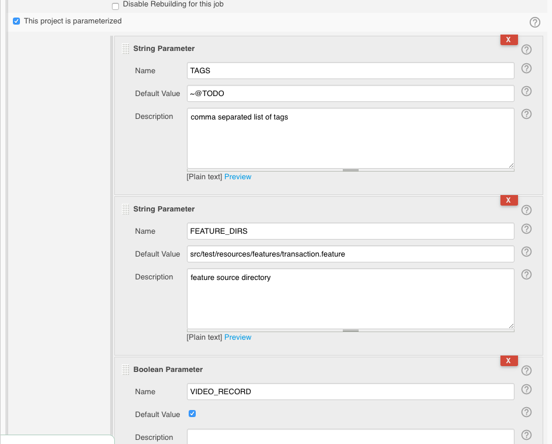
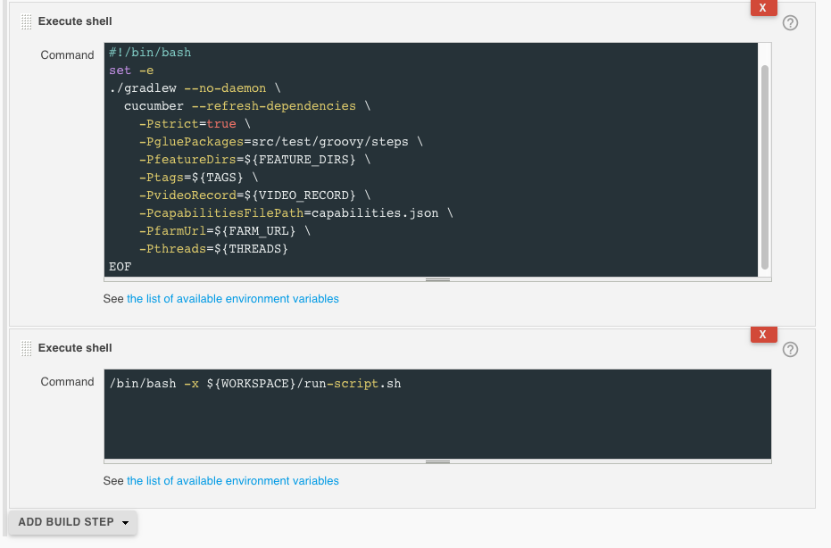
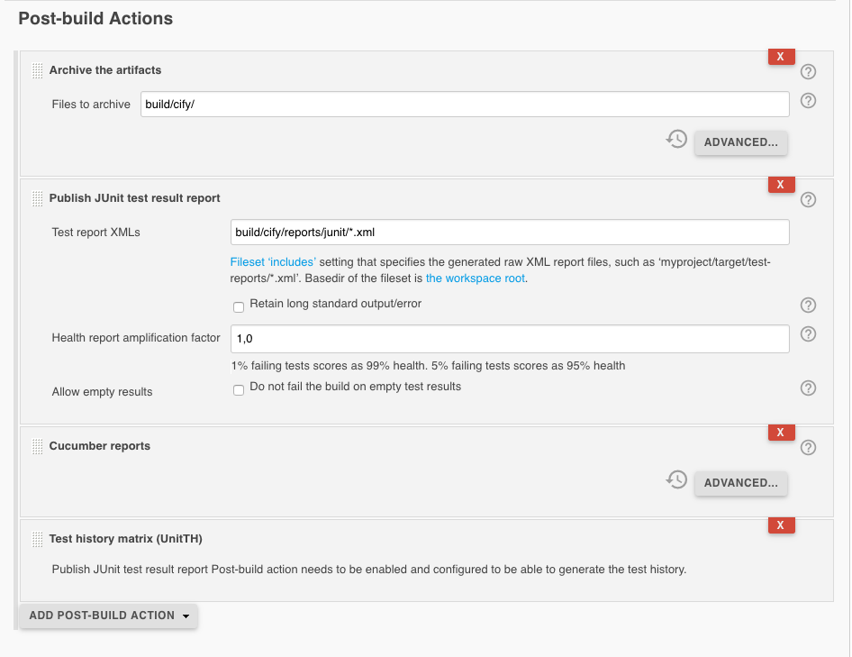

1. [What is Rocket Chat Automation?](#markdown-header-what-is-rocket-chat-automation)
1. [How the project structure looks like?](#markdown-header-how-the-project-structure-looks-like)
1. [What are the preconditions for Rocket Chat Automation project?](#markdown-header-what-are-the-preconditions-for-rocket-chat-automation-project)
1. [Step-By-Step guide for beginners](#markdown-header-step-by-step-guide-for-beginners)
1. [How to run Rocket Chat Automation Project?](#markdown-header-how-to-run-rocket-chat-automation-project)
1. [How to configure Rocket Chat Automation Project?](#markdown-header-how-to-configure-rocket-chat-automation-project)
1. [How to add new tests?](#markdown-header-how-to-add-new-tests)
1. [Learn more about Cify Framework](#markdown-header-learn-more-about-cify-framework)

## What is Rocket Chat Automation?

Rocker Chat automation is automation project used in TTU test automation course.
This project uses Cify, a cross-platform test automation framework for mobile tests.

## Preconditions for Rocket Chat Automation project

- Java 8
- IntelliJ IDEA (or similar IDE)

### Preconditions for real devices

#### iOS

- Follow introduction how to test with iOS 10 from [XCUITEST Driver](https://github.com/appium/appium-xcuitest-driver#real-devices)
- Orientation lock is disabled

## How the project structure looks like?

### Project structure
    
    /
    |-- build
    |   |-- cify
    |       |-- framework-log
    |       |-- log
    |       |-- reports
    |       |-- videos
    |-- gradle
    |   |-- wrapper
    |-- src
    |   |-- test
    |       |-- groovy
    |       |       |-- implementation
    |       |       |-- steps
    |       |-- resources
    |       |       |-- features
    |       |       |-- introduction
    |-- build.gradle
    |-- capabilities.json
    |-- configuration.json
    |-- README.md
    
**gradle/wrapper/** - Gradle wrapper

**build/cify/framework-log/** - Framework logs

**build/cify/log/** - Runner logs

**build/cify/reports/** - Project reports (junit, xml, html)

**build/cify/videos/** - Project videos

**src/test/groovy/implementation** - Implementation layer, client specific implementation

**src/test/groovy/steps** - Cucumber step definitions

**src/test/resources/features** - Cucumber Feature files

**src/test/resources/introduction** - Introduction images for readme purposes

## Step-By-Step guide for beginners

### Run clean build to make sure that everything is okay

Just to make sure that everything is in order run gradle clean build task

On Mac OS X

    ./gradlew clean build
   
On Windows

    gradlew clean build

### Download plugins for IDEA

- Gherkin
- Cucumber for Java
- Cucumber for Groovy

### Add run configuration

- Open Run/Debug configurations on Intellij or Android studio
- Select Cucumber for Java from defaults
- Set src/test/groovy/steps as a Glue
- Press OK


### Add missing capabilities to capabilities.json and  configuration.json

- **remote** capability - Appium service ip to mobile devices (android & iOS)
- **udid** capability iOS device identifier


- configuration.json

Add the appium service URL to remote capability and udid as a iOS identifier

```
{
  "videoRecord": true,
  "videoDir": "build/cify/videos/",
  "capabilities": {
    "android": {
      "capability": "android",
      "UIType": "MobileAndroidApp",
      "deviceName": "Android Device",
      "app": "https://s3-eu-west-1.amazonaws.com/rocket-chat-applications/RocketChat.apk",
      "appPackage": "chat.rocket.android",
      "appActivity": ".activity.MainActivity",
      "fullReset": "true",
      "remote": "http://0.0.0.0:4723/wd/hub"
    },
    "browser": {
      "UIType": "DesktopWeb",
      "capability": "chrome"
    },
    "ios": {
      "capability": "iphone",
      "UIType": "MobileIOSApp",
      "udid": "a04757611e60e0e647cfc6e698617e8efe1e6231",
      "app": "https://s3-eu-west-1.amazonaws.com/rocket-chat-applications/RocketChat.ipa",
      "deviceName": "iPhone",
      "platformName": "iOS",
      "automationName": "XCUITest",
      "fullReset": "true",
      "remote": "http://0.0.0.0:4723/wd/hub"
    }
  }
}

```

- properties

Also when using runner to trigger tests user can add device farm URL into properties file as following:

**fullsuite.properties** file as an example

```
gluePackages=src/test/groovy/steps
featureDirs=src/test/resources/features
tags=~@TODO
videoRecord=true
farmUrl=http://192.168.99.100:4444/wd/hub
```

### Run test

To run tests follow the instructions from [HERE](#markdown-header-how-to-run-rocket-chat-automation-project)

## How to run Rocket Chat Automation Project?

Options for running tests with Rocket Chat Automation project:

- Right click and play **(plug-and-play)**
- Run from command line  **(cify-runner)**

### Plug-And-Play

#### Precondition for plug-and-play

Plug-and-play will use **configuration.json** for configuration file.

- Framework configuration JSON implemented
- **remote** capability is selected in configuration.json
- **udid** capability is selected for iOS in configuration.json

```
{
  "videoRecord": true,
  "videoDir": "build/cify/videos/",
  "capabilities": {
    "android": {
      "capability": "android",
      "UIType": "MobileAndroidApp",
      "deviceName": "Android Device",
      "app": "",
      "fullReset": "true",
      "remote": ""
    },
    "browser": {
      "UIType": "DesktopWeb",
      "capability": "chrome",
      "remote": ""
    },
    "ios": {
      "capability": "iphone",
      "UIType": "MobileIOSApp",
      "automationName": "XCUITest",
      "deviceName": "iOS Device",
      "app": "",
      "udid": "",
      "fullReset": "true",
      "remote": ""
    }
  }
}

```

#### Steps

1. Navigate to Cucumber Feature file that you would like to run
1. Find Scenario you would like to run
1. Right click on Scenario/Right click on Feature
1. Click Run

### With Cify-runner

Cify funner will use **capabilities.json** for configuration.

Runner gives multiple options to trigger tests and test suites.

Gradle wrapper is used in the project. We can trigger gradle tasks like following:

- ./gradlew <task> (on Unix-like platforms such as Linux and Mac OS X)
- gradlew <task> (on Windows using the gradlew.bat batch file)

#### Example of using runner

```
    ./gradlew cucumber -Penv=local
    
```

#### Run specific cucumber tag

Running the command below will trigger all scenarios with smoke tag and exclude all TODO tags.

```
    ./gradlew cucumber -PfeatureDirs=src/test/resources/features -PgluePackages=src/test/groovy/com/here/apps/cpta/steps -Ptags=@smoke,~@TODO
    
```

## How to configure Rocket Chat Automation Project?

User can change **configuration.json** to any capability which is needed.
 
 Example of configuration.json file
 
```
 {
   "videoRecord": false,
   "videoDir": "build/cify/videos/",
   "capabilities": {
     "android": {
       "capability": "android",
       "deviceName": "Android",
       "version": "ANY"
     },
     "browser": {
       "capability": "chrome"
     },
     "ios": {
       "capability": "iphone",
       "deviceName": "iPhone",
       "version": "ANY"
     }
   }
 }
```

**videoRecord** - Enable web driver video recording.

**videoDir** - Directory where videos are saved.

**capabilities** - Are used when user right clicks on scenarios or feature and press run. Capability with given category is taken and triggered.

### Capabilities

Capabilities file is in JSON format and defines capabilities for suite. Users can pass parameters to devices with capabilities json file.

File contains two objects:

- defaults
- set

**defaults**

Defaults is a optional parameter in capabilities json. User can define capabilities for 3 device categories (browser, android, iOS). If default is defined for one category then it will be added to every capability variation (if not defined in the set).

**set**

Set is a list of capabilities to test against. User can define as much capabilities for each device category as needed. Runner will create variations that every capability is tested with every other capabilities from other category.

Valid capability file structure:
```
  {
    "set": {
      "browser": [
        {
          "UIType": "DesktopWeb",
          "capability": "chrome",
          "browserName": "chrome"
        }
      ],
      "ios": [
        {
          "capability": "iphone",
          "UIType": "MobileIOSApp",
          "deviceName": "iOS Device",
          "udid": "",
          "app": "src/test/resources/applications/RocketChat.ipa",
          "autoAcceptAlerts": "true",
          "fullReset": "true",
          "remote":""
        }
      ],
      "android": [
        {
          "capability": "android",
          "UIType": "MobileAndroidApp",
          "deviceName": "Android Device",
          "app": "src/test/resources/applications/RocketChat.apk",
          "fullReset": "true",
          "remote":""
        }
      ]
    }
  }
```
In this case there will be 3 different variations (tasks) to run:

Safari 44, Android 5.1, iOS 9.3.5 on iPad
Opera 12, Android 5.1, iOS 9.3.5 on iPad
Android 6.0 Browser, Android 5.1, iOS 9.3.5 on iPad
There is a possibility to pass capabilities from command line.

Example:
```
./gradlew cucumber -Pcapabilities='{"set": {"browser":[{"version":"52","capability":"chrome"}]}}'

```

### Gradle properties

Cify runner contains 3 tasks:

- cucumber
- help
- parameters

**Cucumber** task collects parameters, device capabilities and feature files, generates task for each feature file, and triggers tests.

**Help** tasks prints all runner parameters and helping information to console.

Setup **parameters** task collects all the information from properties file, command line, defaults, devices and holds them as plugin extension

See all available parameters from [RUNNER README](https://github.com/fobsolutions/cify-runner) 


### Cucumber

Cucumber is used for test creation in Rocket Chat Application

#### Usable tags
    
List of tags used right now:

1. TODO
1. android
1. iOS
1. browser

**TODO** - Not implemented scenarios/features
**android** - Android scenarios
**iOS** - iOS scenarios
**browser** - Browser scenarios
    
#### Adding tags to feature/scenarios
    
Simply add tag you would like to add to scenario or feature as following

```
@NEWTAG
Scenario: eat 5 out of 12
  Given there are 12 cucumbers
  When I eat 5 cucumbers
  Then I should have 7 cucumbers
    
```
     
#### Adding tag to properties    

Add tag to properties file as following

    tags=@NEWTAG

## How to add new tests

### Cucumber

Cucumber features are located in **src/test/resources/features** folder.

Users can add features like default cucumber requires.

Add @TODO tag to feature or scenario when it's not implemented.

      @iOS @TODO
      Scenario: User enters valid hostname on iOS
        Given user opens IOS application
        Then hostname view should be visible
        When user enters "https://open.rocket.chat" into hostname
        And user clicks on select button
        Then login view should be visible

### Step definitions

Step definitions are located in **src/test/groovy/steps** folder.

Users can add step definitions like default cucumber requires.

    When(~/^user enters "([^"]*)" into hostname$/) { String hostname ->
        ActionsImpl.getHostActions().enterHostname(hostname)
    }

### Implementation

- Create interface for needed class
Example:
```
   /**
    * Created by FOB Solutions
    */
   interface IHostnameActions {
   
       /**
        * Verify that host view is visible
        * @return
        */
       boolean isHostViewVisible()
   
       /**
        * Enter hostname
        * @param hostname
        * @return
        */
       void enterHostname(String hostname)
   
       /**
        * Submit host name
        */
       void submit()
   
   }
```
- Implement this interface with available UITypes (Currently there are three: DesktopWeb, MobileAndroidApp, MobileIOSApp)

**HostnameActionsMobileAndroidApp**
**HostnameActionsMobileIOSApp**

Example of one implementation class:
```
class HostnameActionsMobileIOSApp implements IHostnameActions, ActionsMobileIOSApp {

    Device device
    HostnamePage hostnamePage

    HostnameActionsMobileIOSApp(Device device) {
        this.device = device
        this.hostnamePage = new HostnamePage(device)
    }

    /**
     * Verify that host view is visible
     * @return
     */
    @Override
    boolean isHostViewVisible() {
        return isDisplayed(hostnamePage.getHostnameUrlField()) &&
                isDisplayed(hostnamePage.getLogo())
    }

    /**
     * Enter hostname
     * @param hostname
     * @return
     */
    @Override
    void enterHostname(String hostname) {
        sendKeys(hostnamePage.hostnameUrlField, hostname)
    }

    /**
     * Submit host name
     */
    @Override
    void submit() {
        click(hostnamePage.getGoButton())
    }
}

```
- Add new class into ActionsImpl class

ActionsImpl class can be found from **src/test/groovy/com/here/apps/cpta/impl** folder.

```
        /**
         * Get Hostname actions for current device
         * @return
         */
        static IHostnameActions getHostActions() {
            Device currentDevice = DeviceManager.getInstance().getActiveDevice()
            return (IHostnameActions) Actions.getCustomActions(currentDevice, IMPLEMENTATION_PACKAGE + "hostname.actions.HostnameActions")
        }
```

### Page Objects

Page objects hold all the elements that tests need.

Example of a page object:
```
class SettingsPageObjects extends PageObjects {

    @FindBy(css = ".nps-overlay")
    @AndroidFindBy(id = "progressArea")
    @iOSFindBy(className = "XCUIElementTypeSlider")
    WebElement progressArea

    @FindBy(css = ".btn.submit")
    @AndroidFindBy(id = "nps_send_button")
    @iOSFindBy(accessibility = "Send")
    WebElement sendButton

    @FindBy(css = ".step.confirm main h2")
    @AndroidFindBy(id = "successful_title")
    @iOSFindBy(accessibility = "nextFeedbackLabel")
    WebElement feedbackSuccess

    @AndroidFindBy(xpath = "//android.widget.TextView[@text='Units']")
    @iOSFindBy(accessibility = "Units")
    WebElement units

    @iOSFindBy(accessibility = "Debug settings")
    List<WebElement> debugSettings

    @iOSFindBy(accessibility = "Simulation")
    WebElement simulation
    
    SettingsPageObjects(Device device) {
        super(device)
    }
}
```

## How to setup Jenkins Job for Test Automation?

Cify Runner can be used in Jenkins as a default Gradle project.  

### Preconditions

1. Jenkins with version 2.23+
1. Gradle plugin installed on Jenkins

### Step-By-Step guide

1. Create freestyle project
1. Check "Delete workspace before build starts" in Build Environment
1. Add build step "Invoke Gradle script"
1. Select use gradle wrapper
1. Insert "cucumber" with all the parameters you need into Tasks input

``
Example: cucumber -Penv=demo -PfarmUrl=http://localhost:4444/wd/hub
``

### Cucumber HTML reports with Cify Runner

Users can use default Cucumber HTML report.

Cucumber reports plugin can be found in: [Cucumber reports plugin](https://github.com/jenkinsci/cucumber-reports-plugin)

Cucumber reports are saved by default to **build/cify/reports**


### Demonstrative pictures about Jenkins setup









## Learn more about Cify Framework

**Listen my Webinar with SauceLabs**

Listen Webinar [HERE](https://www.youtube.com/watch?v=YyTUz6tsWxA)

**Cify Framework**

Framework is responsible for managing communication with devices, and handling device actions (click, touch, tap, fillIn, sendKeys etc.) independently from device platform.

Learn more from [GitHub](https://github.com/fobsolutions/cify-framework) 

**Cify Runner**

Runner is responsible for parameters management, test configuration and test execution.

Learn more from [GitHub](https://github.com/fobsolutions/cify-runner) 